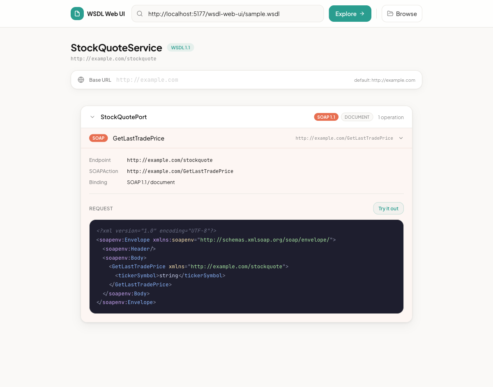
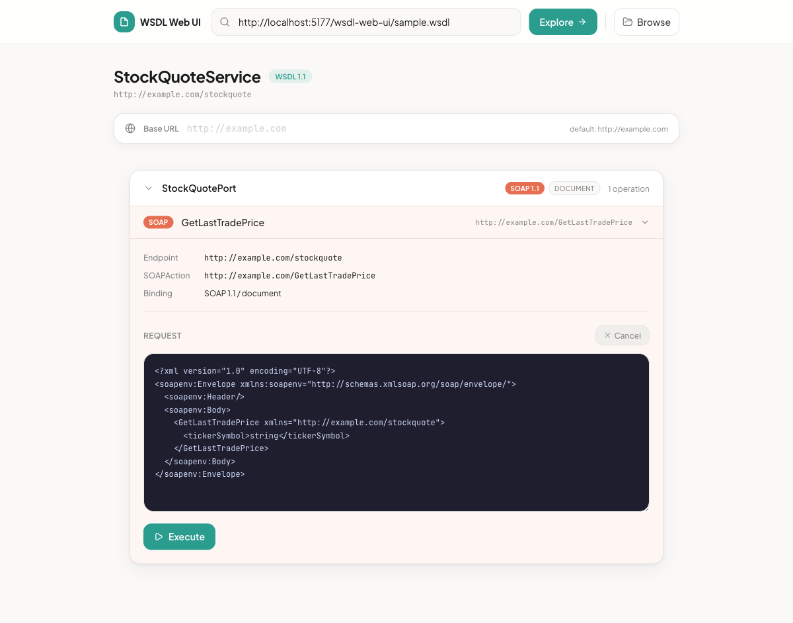

# WSDL Web

[](https://github.com/wsdl-web/wsdl-web/actions/workflows/ci.yml)

A browser-based interactive explorer for WSDL web services. Enter a WSDL URL to inspect its services, endpoints, bindings and operations, then invoke them directly from the browser with auto-generated SOAP requests.

> Think [Swagger UI](https://github.com/swagger-api/swagger-ui), but for SOAP/WSDL.

### [Try it live &rarr;](https://wsdl-web.github.io/wsdl-web)
No install required.

### Or run with Docker

```sh
docker run -p 8080:80 outofcoffee/wsdl-web
```

Then open http://localhost:8080 in your browser.

## Features

- **WSDL 1.1 and 2.0** support with automatic version detection
- **SOAP 1.1 and 1.2** envelope generation and invocation
- **Document and RPC** binding styles
- **Auto-generated SOAP requests** from XSD type definitions, with sample values pre-filled
- **"Try it out" mode** — edit the generated XML, then execute the request and see the response
- **Syntax-highlighted XML** for requests and responses
- **SOAP Fault display** — detects `<soap:Fault>` in responses and renders faultcode, faultstring, and detail in a structured format
- **Response metadata** — HTTP status, response time, full response body
- **Copy as cURL** — copy the SOAP request as a ready-to-use cURL command
- **Inline documentation** — displays `<wsdl:documentation>` from services and operations
- **Custom request headers** — add headers like Authorization, API keys, or WS-Security tokens to requests
- **Base URL override** — redirect requests to a different host (e.g. localhost)
- **Local file support** — browse and load WSDL files from your device
- **Deep linking** — shareable URLs with `?url=` to pre-load a WSDL and `#service/endpoint/operation` to jump to a specific operation

## Screenshots

### Exploring a WSDL service

Load a WSDL to see its services, endpoints and operations with auto-generated SOAP request envelopes and syntax highlighting.



### Try it out

Edit the request XML and execute it directly from the browser.



## Usage

1. Open the app in your browser.
2. Enter a WSDL URL in the top bar and click **Explore** (or press Enter).
3. The WSDL is fetched and parsed. You'll see the service name, target namespace, and a list of endpoint groups.
4. Expand an endpoint group to see its operations.
5. Click an operation to see its details: endpoint address, SOAPAction, binding style, and a pre-generated SOAP request envelope.
6. Click **Try it out** to make the request editable.
7. Modify the XML if needed, then click **Execute** to send the SOAP request.
8. The response (status code, timing, and body XML) is displayed below.

### Deep linking

Share a URL that pre-loads a WSDL and navigates to a specific operation:

```
https://wsdl-web.github.io/wsdl-web/?url=https://example.com/service?wsdl#ServiceName/PortName/OperationName
```

- `?url=<wsdl-url>` loads the WSDL automatically
- `#Service/Endpoint/Operation` expands the target group and operation
- `#Service/Endpoint` expands just the endpoint group

The URL updates as you navigate, so you can copy it from the address bar at any time.

### CORS

SOAP services typically don't set CORS headers, so requests from the browser may be blocked. If this happens, you can:

- Run a local CORS proxy such as [cors-anywhere](https://github.com/Rob--W/cors-anywhere) and prefix your endpoint URL with the proxy address.
- Use a browser extension that adds CORS headers.
- Serve the app from the same origin as the SOAP service.

The same applies when fetching the WSDL itself — if the WSDL URL doesn't allow cross-origin requests, you'll need to proxy it.

## Building from source

Requires Node.js 18+.

```sh
# Install dependencies
npm install

# Start the development server
npm run dev

# Run tests
npm test

# Build for production
npm run build
```

The production build is output to `dist/`. Serve it with any static file server.

## Supported by Mocks Cloud

This project is supported by [Mocks Cloud](https://www.mocks.cloud) — instant cloud-hosted mocks from your OpenAPI specs and WSDL files. Upload a spec, get a live mock endpoint in seconds. Powered by the [Imposter](https://www.imposter.sh) open source mock engine.

## License

Apache 2.0
